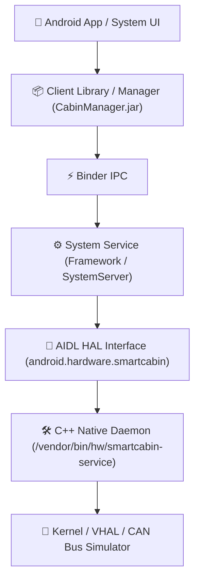

# AOSP Vertical Architecture Blueprint

A architectural blueprint and fast-iteration guide for vertical slice development on **Android Open Source Project (AOSP)** and **Android Automotive OS (AAOS)** — optimized for a hybrid development workflow between **macOS (Apple Silicon host)** and **Linux (UTM virtual machine)**.

---

## 🏗️ Vertical Slice Architecture Overview (Smart Cabin Example)

Vertical development cuts across all layers from the hardware abstraction layer (HAL) up to the user-facing application:



---

## 🚀 Fast Iteration Development Workflow

### 1. Select the Right "Unlocked" ROM Image
* **Target Image:** Download an **Automotive** or **AOSP** system image with `arm64-v8a` architecture using the Android Studio SDK Manager or `sdkmanager` CLI:
  ```bash
  sdkmanager "system-images;android-35-ext15;android-automotive;arm64-v8a"
  ```
* **Target Type:** You **must** select **Google APIs** or **AOSP** (`userdebug` build).
* ⚠️ **Warning:** Avoid **Google Play** images. They are production-signed and locked against root permissions, preventing modifications to system partitions (`/system`, `/vendor`).
* 💡 **Launch via provided helper script:**
  ```bash
  # Automatically resolves Android SDK path and launches Automotive_15_ARM64 with -writable-system
  ./scripts/start_emulator.sh
  # Or specify a custom AVD name:
  ./scripts/start_emulator.sh <AVD_NAME>
  ```

---

### 2. Unlock Partitions (One-time Setup)
To enable `adb push` into `/system` or `/vendor`, you must launch the AVD with the `-writable-system` flag, then disable device integrity checks (**dm-verity**):

#### Option A: Automated via Helper Script (Recommended)
Open a new terminal tab while the emulator is running:
```bash
./scripts/unlock_partitions.sh
```

#### Option B: Manual Execution
1. **Launch the emulator with writable system support:**
   ```bash
   emulator -avd <AVD_NAME> -writable-system
   ```

2. **Disable partition verification (dm-verity):**
   ```bash
   adb root
   adb disable-verity
   adb reboot
   ```

3. **Once the device reboots, remount partitions with write permissions:**
   ```bash
   adb root
   adb remount
   ```

---

### 3. Build Modules Locally (On Linux / UTM VM)
In the Ubuntu (UTM) environment, avoid running a full system `m` build (which takes hours). Build only the target modules you created or modified:

* **Build C++ HAL Daemon:**
  ```bash
  m android.hardware.smartcabin-service
  ```
* **Build Java Manager Library:**
  ```bash
  m CabinManager
  ```
* **Retrieve Output Artifacts:** Collect the generated binaries or `.jar` files from:
  ```bash
  out/target/product/<target_device>/vendor/bin/hw/
  out/target/product/<target_device>/system/framework/
  ```
  and synchronize/copy them over to the host machine (macOS).

---

### 4. Deploy Artifacts to Emulator (On macOS Host)
Push the executable binaries and service configuration files directly into the emulator via ADB:

```bash
adb push smartcabin-service /vendor/bin/hw/
adb push smartcabin.rc /vendor/etc/init/
adb push smartcabin-manifest.xml /vendor/etc/vintf/manifest/
```

---

### 5. Bypass SELinux & Start the Service
When files are pushed externally via ADB, SELinux security contexts are often missing or mislabeled, causing Android's init to block execution.

1. **Set SELinux to Permissive mode (for prototyping / development):**
   ```bash
   adb shell setenforce 0
   ```

2. **Restart SystemServer to register new framework services (no need to reboot the entire emulator):**
   ```bash
   adb shell stop && adb shell start
   ```

3. **Verify service status:**
   ```bash
   # Check if native HAL daemon is running
   adb shell ps -A | grep smartcabin

   # Inspect logcat output
   adb shell logcat -s SmartCabin
   ```
