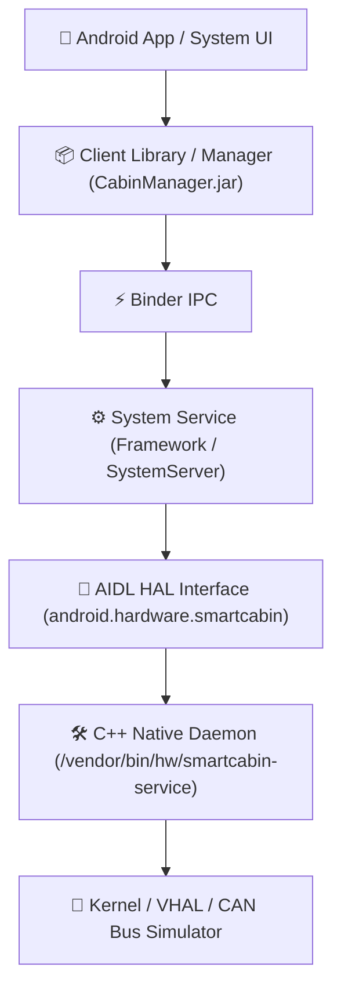

# AOSP Vertical Architecture Blueprint

A architectural blueprint and fast-iteration guide for vertical slice development on **Android Open Source Project (AOSP)** and **Android Automotive OS (AAOS)** — optimized for a hybrid development workflow between **macOS (Apple Silicon host)** and **Linux (UTM virtual machine)**.

---

## 🏗️ Vertical Slice Architecture Overview (Smart Cabin Example)

Vertical development cuts across all layers from the hardware abstraction layer (HAL) up to the user-facing application:



---

## 🔌 CAN -> VHAL Pipeline

From the voltage on CAN_H / CAN_L to `CarPropertyManager`, one tested layer at a time.
Start with [docs/ROADMAP.md](docs/ROADMAP.md).

```bash
make test                                   # Python simulator + C++ host tests
cd tools/cansim && python3 -m cansim wave 3E8#7902          # see a frame as CAN_H / CAN_L
python3 -m cansim serve THERMAL_STATUS --ramp OutsideTemp:-10:40:20   # fake ECU
native/build/bp-canbridge tcp:127.0.0.1:29536                # what VHAL receives
```

| Path | What |
|------|------|
| [vehicle/dbc/blueprint.dbc](vehicle/dbc/blueprint.dbc) | Signal database, source of truth |
| [tools/cansim/](tools/cansim/) | CAN simulator: bits, CAN_H/CAN_L, DBC codec, TCP/vcan streaming, codegen |
| [native/](native/) | C++ signal codec, transports (SocketCAN/TCP), CAN bridge |
| [vhal/aosp/](vhal/aosp/) | `CanVehicleHardware` + VHAL AIDL service |
| [docs/vhal/adding-a-new-signal.md](docs/vhal/adding-a-new-signal.md) | Checklist for every new signal |

---

## 🚀 Fast Iteration Development Workflow

### ⚡ Quick Start (One Command)
Launch Android 15 Automotive and automatically unlock write permissions on `/system` and `/vendor`:
```bash
make run
# or: ./scripts/run.sh
```

---

### Step-by-Step Breakdown

#### 1. ROM Selection & Setup
* **Target:** Android 15 Automotive `arm64-v8a` (`system-images;android-35-ext15;android-automotive;arm64-v8a`).
* **Type:** Google APIs (`userdebug`). Avoid Google Play images as they block root and partition remounting.
* **AVD:** `Automotive_15_ARM64` (preconfigured with GPU acceleration and landscape orientation).

#### 2. Partition Unlock (Root, dm-verity, remount)
To allow pushing files into `/system` and `/vendor`:
```bash
# Handled automatically by `make run`, or manually via:
adb wait-for-device && adb root && adb disable-verity && adb reboot
adb wait-for-device && adb root && adb remount
```

---

### 3. Build Modules Locally (On Linux / UTM VM)
In the Ubuntu (UTM) environment, avoid running a full system `m` build (which takes hours). Build only the target modules you created or modified:

* **Build C++ HAL Daemon:**
  ```bash
  m android.hardware.smartcabin-service
  ```
* **Build Java Manager Library:**
  ```bash
  m CabinManager
  ```
* **Retrieve Output Artifacts:** Collect the generated binaries or `.jar` files from:
  ```bash
  out/target/product/<target_device>/vendor/bin/hw/
  out/target/product/<target_device>/system/framework/
  ```
  and synchronize/copy them over to the host machine (macOS).

---

### 4. Deploy Artifacts to Emulator (On macOS Host)
Push the executable binaries and service configuration files directly into the emulator via ADB:

```bash
adb push smartcabin-service /vendor/bin/hw/
adb push smartcabin.rc /vendor/etc/init/
adb push smartcabin-manifest.xml /vendor/etc/vintf/manifest/
```

---

### 5. Bypass SELinux & Start the Service
When files are pushed externally via ADB, SELinux security contexts are often missing or mislabeled, causing Android's init to block execution.

1. **Set SELinux to Permissive mode (for prototyping / development):**
   ```bash
   adb shell setenforce 0
   ```

2. **Restart SystemServer to register new framework services (no need to reboot the entire emulator):**
   ```bash
   adb shell stop && adb shell start
   ```

3. **Verify service status:**
   ```bash
   # Check if native HAL daemon is running
   adb shell ps -A | grep smartcabin

   # Inspect logcat output
   adb shell logcat -s SmartCabin
   ```
