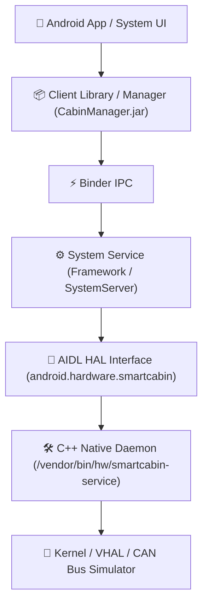

# AOSP Vertical Architecture Blueprint

Blueprint và cẩm nang kiến trúc phát triển tính năng theo chiều dọc (Vertical Slice) trên nền tảng **Android Open Source Project (AOSP)** / **Android Automotive OS (AAOS)** — tối ưu hóa quy trình làm việc hybrid giữa **macOS (Apple Silicon)** và máy ảo **Linux (UTM)**.

---

## 🏗️ Tổng quan kiến trúc Vertical Slice (Smart Cabin Example)

Mô hình phát triển dọc đi từ lớp phần cứng (HAL) đến ứng dụng người dùng (App):



---

## 🚀 Quy trình phát triển & triển khai nhanh (Fast Iteration Workflow)

### 1. Chọn đúng bản ROM "mở khóa"
* **Image target:** Tải image **Automotive** hoặc **AOSP** kiến trúc `arm64-v8a` từ SDK Manager của Android Studio.
* **Loại Image:** Bắt buộc chọn loại target là **Google APIs** hoặc **AOSP** (bản `userdebug`).
* ⚠️ **Lưu ý:** Tuyệt đối tránh các bản có chữ **Google Play** vì chúng bị khóa quyền root và chữ ký bảo mật, không thể can thiệp vào phân vùng hệ thống (`/system`, `/vendor`).
* 💡 **Khởi chạy nhanh qua script có sẵn:**
  ```bash
  # Tự động tìm Android SDK và khởi chạy AVD với cờ -writable-system
  ./scripts/start_emulator.sh
  # Hoặc chỉ định tên AVD khác:
  ./scripts/start_emulator.sh <Tên_AVD>
  ```

---

### 2. Bẻ khóa phân vùng (Chỉ cần thực hiện 1 lần đầu)
Để có thể sử dụng `adb push` vào `/system` hoặc `/vendor`, bạn phải khởi chạy AVD với cờ cho phép ghi (`-writable-system`), sau đó tắt tính năng bảo vệ vẹn toàn (**dm-verity**):

#### Cách 1: Tự động hóa qua script (Khuyên dùng)
Mở một tab terminal mới trong khi emulator đang chạy:
```bash
./scripts/unlock_partitions.sh
```

#### Cách 2: Chạy thủ công từng lệnh
1. **Khởi chạy giả lập với quyền ghi:**
   ```bash
   emulator -avd <Tên_AVD> -writable-system
   ```

2. **Vô hiệu hóa bảo mật phân vùng (dm-verity):**
   ```bash
   adb root
   adb disable-verity
   adb reboot
   ```

3. **Sau khi máy ảo boot lên lại, mở khóa quyền ghi đè:**
   ```bash
   adb root
   adb remount
   ```

---

### 3. Build Module Cục Bộ (Trên môi trường Linux / UTM)
Trong môi trường Ubuntu (UTM trên Apple Silicon), không cần chạy lệnh `m` toàn hệ thống (mất nhiều giờ). Chỉ cần build đích danh module vừa tạo hoặc chỉnh sửa:

* **Build C++ HAL Daemon:**
  ```bash
  m android.hardware.smartcabin-service
  ```
* **Build Java Manager Library:**
  ```bash
  m CabinManager
  ```
* **Lấy output:** Thu thập các file binary hoặc file `.jar` vừa được sinh ra trong thư mục:
  ```bash
  out/target/product/<target_device>/vendor/bin/hw/
  out/target/product/<target_device>/system/framework/
  ```
  sau đó đồng bộ / copy sang máy host (macOS).

---

### 4. Bơm code vào giả lập (Trên macOS Host)
Đẩy trực tiếp file thực thi và các file cấu hình `init`, `VINTF manifest` vào máy ảo qua ADB:

```bash
adb push smartcabin-service /vendor/bin/hw/
adb push smartcabin.rc /vendor/etc/init/
adb push smartcabin-manifest.xml /vendor/etc/vintf/manifest/
```

---

### 5. Xử lý rào cản SELinux & Khởi chạy Service
Khi push file từ bên ngoài vào, nhãn bảo mật SELinux của file sẽ bị sai hoặc thiếu policy, khiến hệ điều hành chặn daemon khởi chạy.

1. **Chuyển SELinux sang chế độ Permissive (dùng trong giai đoạn prototype/dev):**
   ```bash
   adb shell setenforce 0
   ```

2. **Khởi động lại SystemServer để Android nhận diện service mới (không cần reboot cả máy ảo):**
   ```bash
   adb shell stop && adb shell start
   ```

3. **Kiểm tra trạng thái service:**
   ```bash
   # Kiểm tra service HAL đang chạy
   adb shell ps -A | grep smartcabin

   # Xem logcat của service
   adb shell logcat -s SmartCabin
   ```
